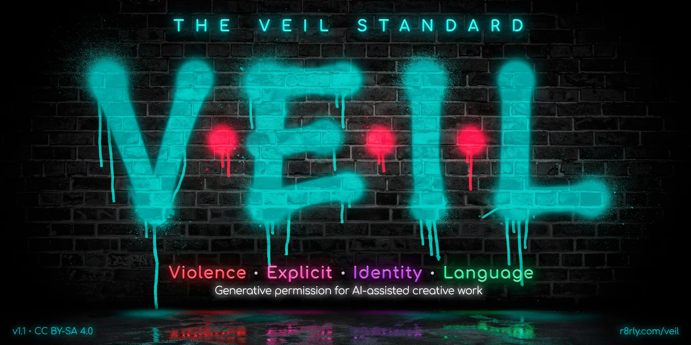
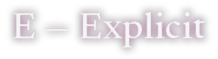
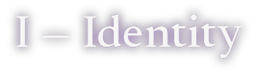
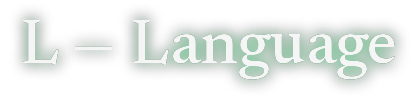

<p align="center"></p>

# The VEIL Standard

**V · E · I · L — Generative Permission Standard for AI-Assisted Creative Work**

VEIL is a portable, signed permission envelope that a creator declares before an AI-assisted generation session begins. It specifies the intensity range the work requires across eight content axes — a **ceiling** the session must not exceed, and an optional **floor** the work must not be sanitised below.

> **VEIL expresses the author's target but never overrides a model's own gating.**

VEIL is the generation-side companion to [the SHOW Standard](https://github.com/r8rly/show) (content classification of finished work) and [the SCRIPTS Standard](https://github.com/r8rly/scripts) (experience rating). Works generated under a VEIL envelope should receive a SHOW rating at or below their VEIL ceilings.

---

## The context object

A VEIL envelope is a JSON object issued by a platform at the verification tier it can substantiate:

```json
{
  "veil_version": "1.1",
  "context_id": "a1b2c3d4-0001",
  "verified_at": "2026-08-08T09:00:00+10:00",
  "verification_tier": "A",
  "verification_method": "government_id",
  "issuing_platform": "example_platform",
  "creator_id": "creator-0001",
  "jurisdiction": "AU",
  "axes": {
    "S": { "floor": 0, "ceiling": 5 },
    "H": { "floor": 2, "ceiling": 5 },
    "O": { "floor": 2, "ceiling": 5 },
    "W": { "floor": 0, "ceiling": 10 },
    "V": { "floor": 0, "ceiling": 5 },
    "E": { "floor": 2, "ceiling": 5 },
    "I": { "floor": 0, "ceiling": 5 },
    "L": { "floor": 1, "ceiling": 3 }
  },
  "lane": "18+",
  "content_type": "fiction",
  "signature": "[HMAC-SHA256 of payload]"
}
```

Validate against [`veil-context.schema.json`](./veil-context.schema.json):

```bash
# Node
npx ajv-cli validate -s veil-context.schema.json -d my-envelope.json

# Python
pip install jsonschema && python -c "
import json, jsonschema
jsonschema.validate(json.load(open('my-envelope.json')),
                    json.load(open('veil-context.schema.json')))
print('valid')"
```

---

## The eight axes

Four axes are imported directly from SHOW; four are VEIL-specific. Axis definitions for S·H·O·W live in [the SHOW Standard](https://github.com/r8rly/show) and are not restated here.

| Axis | Name | Source | Range | Governs |
| :-: | :-- | :-- | :-: | :-- |
| S | Spice | SHOW | 0–6 | Sexual content category and type |
| H | Heat | SHOW | 0–5 | Emotional and romantic intensity |
| O | OMG | SHOW | 0–5 | Darkness, trauma, moral complexity |
| W | WTF | SHOW | 0–10 | Transgression and unconventionality |
| V | Violence | VEIL | 0–5 | Physical harm and conflict intensity |
| E | Explicit | VEIL | 0–5 | Volume and generative depth of explicit content |
| I | Identity | VEIL | 0–5 | Complexity of identity treatment |
| L | Language | VEIL | 0–3 | Adult language register |

<p>
&nbsp;&nbsp;
&nbsp;&nbsp;
&nbsp;&nbsp;

</p>

Full level tables for V, E, I, L are in [the specification](./VEIL-Standard-v1.1.md).

---

## Ceilings and floors

**Ceiling** — the maximum intensity authorised for the session.
**Floor** — the minimum intensity the work requires. Sanitisation below a declared floor is a generation failure, the same as excess above a ceiling. Floors default to 0 (no minimum).

A dark-fiction author declaring `O: { "floor": 3, "ceiling": 5 }` has established that the work requires OMG at level 3 or above; output flattened to O0 has failed the envelope.

---

## Verification tiers

Envelopes are issued at the tier the platform can substantiate. Higher tiers unlock higher ceilings.

| Tier | Label | Method |
| :-: | :-- | :-- |
| U | Unverified | Anonymous / guest |
| D | Device | Session token / logged-in |
| C | Platform | Self-declared age, platform trust |
| B | Soft Verify | Card / age estimation / trust score |
| A | Hard Verify | Government ID / certified biometric |

Per-tier ceiling values are in [the specification](./VEIL-Standard-v1.1.md#verification-tiers).

---

## Standard age profiles

Five ready-to-use profiles in [`profiles/`](./profiles/):

| File | Profile | Audience |
| :-- | :-- | :-- |
| `veil-u13.json` | VEIL-U13 | Under 13 |
| `veil-13.json` | VEIL-13 | Early YA |
| `veil-16.json` | VEIL-16 | Upper YA |
| `veil-18.json` | VEIL-18 | Adult (Tier B) |
| `veil-18v.json` | VEIL-18V | Adult (Tier A hard verify) |

Each contains the full eight-axis floor/ceiling set from the specification, ready to drop into a platform's persona storage.

---

## Absolute limits

Two categories sit outside VEIL's scope at every level and every tier: **sexual content involving minors** and **operational harm instruction**. These are jurisdictional legal requirements, not platform additions. No envelope places them in scope. See [the specification](./VEIL-Standard-v1.1.md#absolute-limits).

---

## Implementing

**Platforms** — store a VEIL profile per creator or persona, issue envelopes at your substantiated tier, sign with HMAC-SHA256, rotate `context_id` per session.

**Providers** — accept the envelope as a structured prefix or a dedicated parameter, validate the signature before applying above-default ceilings, log context IDs for audit, publish compliance status.

The full implementer section is in [the specification](./VEIL-Standard-v1.1.md#for-llm-providers-and-platform-implementers).

---

## Versioning

Current: **v1.1** (August 2026). See [the specification](./VEIL-Standard-v1.1.md#versioning) for history and the v1.2 roadmap.

## Licence & attribution

**The VEIL Standard** · Created by Modern Media Mastery & LMDC · held in trust by [r8rly.org](https://r8rly.org) · verified on [r8rly.com](https://r8rly.com)

Licensed [CC BY-SA 4.0](https://creativecommons.org/licenses/by-sa/4.0/). Free to implement and extend. Attribution required; derivatives share-alike. The R8rly platform mark and VEIL certification badge remain protected and require platform certification.

<https://r8rly.com/veil>
